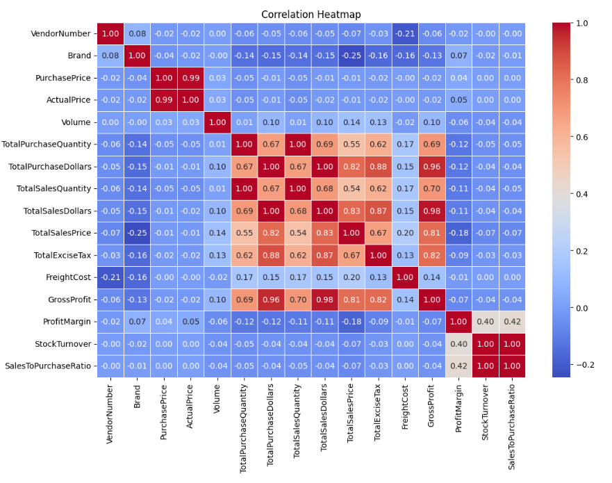
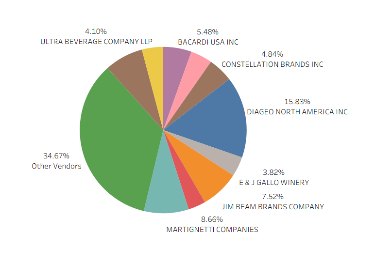
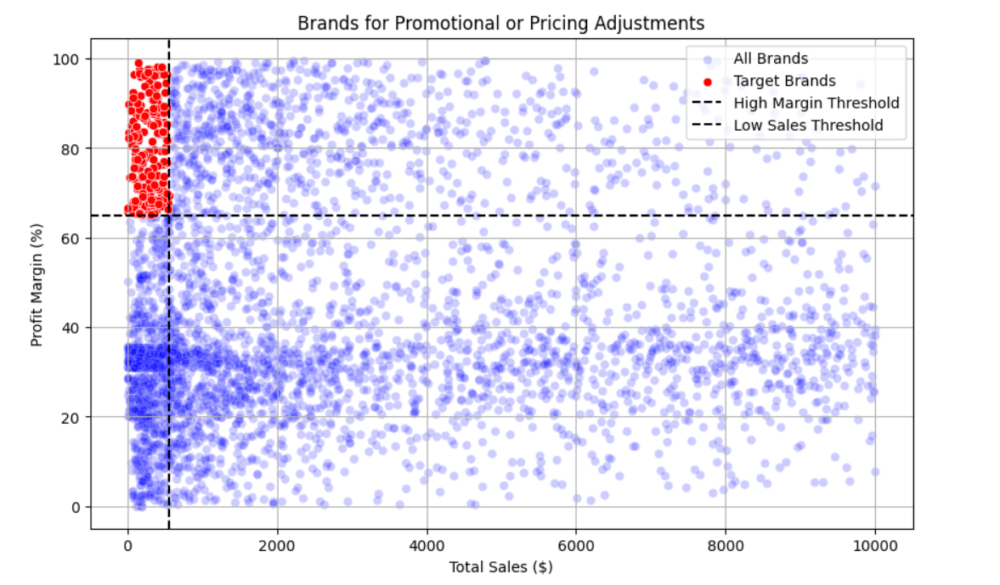

# Vendor Performance Analysis

## Overview
End-to-end data analysis project using Python, SQL, and Tableau to evaluate vendor performance.

## Objectives
- Identify top-performing vendors  
- Detect low-performing vendors  
- Analyze the impact of profit and freight cost

## Tools Used
- Python (Pandas)
- SQL
- Jupyter Notebook
- Tableau

Purchase Price vs. Total Sales Dollars & Gross Profit  
Weak correlation (-0.012 and -0.016), indicating that price variations do not significantly impact sales revenue or profit.  

Total Purchase Quantity vs. Total Sales Quantity  
Strong correlation (0.999), confirming efficient inventory turnover.  

Profit Margin vs. Total Sales Price  
Negative correlation (-0.179), suggesting increasing sales prices may lead to reduced margins, possibly due to competitive pricing pressures.  

Stock Turnover vs. Gross Profit & Profit Margin  
Weak negative correlation (-0.038 & -0.055), indicating that faster stock turnover does not necessarily equate to higher profitability.  

## Key Business Insights
- Top 10 vendors contribute a significant percentage of total sales, indicating heavy dependency on a small group of vendors.
- Several vendors generate high revenue but have low profit margins due to high freight costs and operational expenses.
- Freight cost has a noticeable negative impact on profitability for certain vendors, reducing overall margins.
- A group of vendors shows consistently low sales and profit, indicating potential inefficiencies or underperformance.
- Profit margins vary significantly across vendors, suggesting inconsistent pricing or cost management strategies.
- Some vendors maintain balanced performance with both high sales and strong profit margins, making them ideal for long-term partnerships.
- Data analysis revealed opportunities to optimize vendor selection by focusing on high-margin and low-cost vendors.
- Outlier vendors with unusually high costs or low returns were identified, which may require further investigation.

